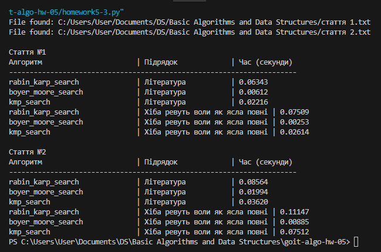

# goit-algo-hw-05

Висновки

Стаття №1
Алгоритм Рабіна-Карпа:
Існуючий підрядок: 0.06434 секунд
Вигаданий підрядок: 0.07509 секунд
Загальний час: Найдовший для вигаданого підрядка

Алгоритм Боєра-Мура:
Існуючий підрядок: 0.00612 секунд
Вигаданий підрядок: 0.00253 секунд
Загальний час: Найшвидший для вигаданого підрядка

Алгоритм Кнута-Морріса-Пратта:
Існуючий підрядок: 0.02216 секунд
Вигаданий підрядок: 0.02614 секунд
Загальний час: Середній час виконання

Стаття №2
Алгоритм Рабіна-Карпа:
Існуючий підрядок: 0.08564 секунд
Вигаданий підрядок: 0.11147 секунд
Загальний час: Найдовший для вигаданого підрядка

Алгоритм Боєра-Мура:
Існуючий підрядок: 0.01994 секунд
Вигаданий підрядок: 0.00885 секунд
Загальний час: Найшвидший для вигаданого підрядка

Алгоритм Кнута-Морріса-Пратта:
Існуючий підрядок: 0.02010 секунд
Вигаданий підрядок: 0.07512 секунд
Загальний час: Середній час виконання

Загальні висновки
Боєра-Мура: Найшвидший алгоритм для обох статей.
Кнута-Морріса-Пратта: Середній час виконання.
Рабіна-Карпа: Найдовший час виконання, особливо для вигаданого підрядка.

Отже,  слід використовувати алгоритм Боєра-Мура для найшвидшого пошуку як існуючих, так і вигаданих підрядків у текстах.